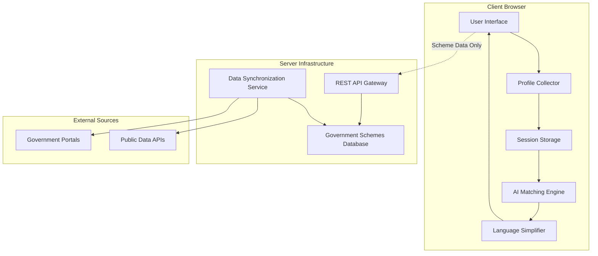

# Design Document: Community Access Assistant

## Overview

The Community Access Assistant is a privacy-focused web application that democratizes access to government benefits through intelligent matching and simplified presentation. The system employs a client-side architecture to ensure user privacy while providing personalized recommendations for government schemes based on user profiles.

The application follows a three-stage process: profile collection through an intuitive questionnaire, AI-powered matching against a comprehensive government schemes database, and presentation of results in simplified language with clear application guidance. The system prioritizes accessibility and inclusion, supporting users with varying digital literacy levels through multiple interaction modalities.

## Architecture

The system employs a client-side-heavy architecture to maximize privacy and minimize data transmission:



### Key Architectural Decisions

1. **Client-Side Processing**: All user profile data remains in the browser's session storage and is processed locally to ensure privacy
2. **Stateless Server**: The server only provides government scheme data and performs no user tracking or profile storage
3. **Offline-First Design**: Core matching functionality works without continuous internet connectivity once scheme data is loaded
4. **Progressive Enhancement**: Basic functionality works on all devices, with enhanced features for capable browsers

## Components and Interfaces

### Profile Collector Component

Responsible for gathering user demographic and socioeconomic information through an adaptive questionnaire interface.

**Interface:**
```typescript
interface UserProfile {
  occupation: OccupationType;
  ageGroup: AgeRange;
  incomeRange: IncomeLevel;
  familyMembers: FamilyMember[];
  location: LocationInfo;
  specialCircumstances: string[];
}

interface ProfileCollector {
  collectProfile(): Promise<UserProfile>;
  validateProfile(profile: Partial<UserProfile>): ValidationResult;
  updateProfile(profile: UserProfile, updates: Partial<UserProfile>): UserProfile;
}
```

### AI Matching Engine

Core component that analyzes user profiles against government scheme eligibility criteria to identify relevant benefits.

**Interface:**
```typescript
interface MatchingEngine {
  findMatches(profile: UserProfile, schemes: GovernmentScheme[]): MatchResult[];
  rankMatches(matches: MatchResult[]): MatchResult[];
  explainMatch(match: MatchResult): MatchExplanation;
}

interface MatchResult {
  scheme: GovernmentScheme;
  eligibilityScore: number;
  applicableMembers: FamilyMember[];
  missingCriteria: EligibilityCriterion[];
}
```

### Language Simplifier

Transforms complex government language into accessible explanations tailored to user education levels.

**Interface:**
```typescript
interface LanguageSimplifier {
  simplifySchemeDescription(scheme: GovernmentScheme, userProfile: UserProfile): SimplifiedScheme;
  generateApplicationSteps(scheme: GovernmentScheme): ApplicationStep[];
  explainEligibility(criteria: EligibilityCriterion[], userProfile: UserProfile): EligibilityExplanation;
}
```

### Government Schemes Database

Maintains up-to-date information about all available government benefits and their eligibility criteria.

**Interface:**
```typescript
interface SchemesDatabase {
  getAllSchemes(): Promise<GovernmentScheme[]>;
  getSchemesByCategory(category: BenefitType): Promise<GovernmentScheme[]>;
  searchSchemes(query: string): Promise<GovernmentScheme[]>;
  refreshFromSources(): Promise<void>;
}
```

## Data Models

### Core Data Structures

```typescript
interface GovernmentScheme {
  id: string;
  name: string;
  description: string;
  benefitType: BenefitType;
  eligibilityCriteria: EligibilityCriterion[];
  applicationProcess: ApplicationStep[];
  documents: RequiredDocument[];
  contactInfo: ContactInformation;
  source: DataSource;
  lastUpdated: Date;
}

interface EligibilityCriterion {
  type: CriterionType;
  field: string;
  operator: ComparisonOperator;
  value: any;
  description: string;
}

interface FamilyMember {
  relationship: RelationshipType;
  age: number;
  occupation?: OccupationType;
  educationLevel?: EducationLevel;
  specialNeeds?: string[];
}

interface ApplicationStep {
  stepNumber: number;
  description: string;
  requiredDocuments: string[];
  estimatedTime: string;
  onlineAvailable: boolean;
  helplineNumber?: string;
}
```

### Enumeration Types

```typescript
enum BenefitType {
  SCHOLARSHIP = "scholarship",
  HEALTHCARE = "healthcare", 
  FINANCIAL_AID = "financial_aid",
  EDUCATION = "education",
  EMPLOYMENT = "employment",
  HOUSING = "housing",
  AGRICULTURE = "agriculture"
}

enum OccupationType {
  FARMER = "farmer",
  STUDENT = "student",
  DAILY_WAGE_WORKER = "daily_wage_worker",
  GOVERNMENT_EMPLOYEE = "government_employee",
  TEACHER = "teacher",
  UNEMPLOYED = "unemployed",
  SELF_EMPLOYED = "self_employed"
}

enum CriterionType {
  AGE_RANGE = "age_range",
  INCOME_LIMIT = "income_limit",
  OCCUPATION = "occupation",
  EDUCATION_LEVEL = "education_level",
  FAMILY_SIZE = "family_size",
  LOCATION = "location"
}
```

## Correctness Properties

*A property is a characteristic or behavior that should hold true across all valid executions of a system—essentially, a formal statement about what the system should do. Properties serve as the bridge between human-readable specifications and machine-verifiable correctness guarantees.*

### Property 1: Profile Validation Completeness
*For any* user profile input, the validation system should correctly identify all missing required fields and accept only profiles with all required fields present.
**Validates: Requirements 1.3, 1.4**

### Property 2: Localization Consistency  
*For any* supported language setting, all user interface elements should be rendered in the selected language consistently throughout the application.
**Validates: Requirements 1.5**

### Property 3: Comprehensive Scheme Matching
*For any* complete user profile and scheme database, the matching engine should return all and only those schemes where the user profile satisfies the eligibility criteria, including schemes applicable to individual family members.
**Validates: Requirements 2.2, 2.3**

### Property 4: Data Freshness Detection
*For any* government scheme in the database, schemes older than the configured staleness threshold should be automatically flagged for review.
**Validates: Requirements 3.4**

### Property 5: Source Attribution Completeness
*For any* displayed government scheme, the rendered output should include complete source attribution information.
**Validates: Requirements 3.5**

### Property 6: Language Simplification Preservation
*For any* complex government text, the simplified version should maintain all critical information while meeting readability criteria and including definitions for technical terms.
**Validates: Requirements 4.1, 4.2, 4.5**

### Property 7: Personalized Explanation Generation
*For any* user profile and eligibility criteria, the generated explanations should include concrete examples that relate to the user's specific profile characteristics.
**Validates: Requirements 4.3, 4.4**

### Property 8: Privacy Compliance
*For any* user session, no profile data should persist beyond session termination, no tracking mechanisms should be created, and all profile processing should occur locally without external data transmission.
**Validates: Requirements 5.1, 5.2, 5.3, 5.4**

### Property 9: Voice Interface Functionality
*For any* valid voice command within the supported command set, the system should produce the expected action and provide appropriate voice feedback.
**Validates: Requirements 6.2**

### Property 10: Error Guidance Quality
*For any* invalid user input, the system should provide specific, actionable guidance that helps users correct their errors.
**Validates: Requirements 6.3**

### Property 11: Accessibility Compliance
*For any* user interface element, keyboard navigation should be supported and content should meet accessibility guidelines for font size and contrast ratios.
**Validates: Requirements 6.4, 6.5**

### Property 12: Demographic-Aware Matching
*For any* user profile containing family members of different demographic groups (children, youth, women, senior citizens), the matching results should include appropriate schemes for each demographic group.
**Validates: Requirements 7.2**

### Property 13: Result Organization by Category
*For any* user profile that qualifies for multiple benefit types, the results should be properly organized by benefit category with all relevant options presented.
**Validates: Requirements 7.3**

### Property 14: Benefit Category Extensibility
*For any* new benefit category added to the system, existing matching functionality should continue to work correctly without degradation.
**Validates: Requirements 7.5**

### Property 15: Complete Application Guidance
*For any* government scheme, the application guidance should include step-by-step instructions, all required documents, deadline information (where applicable), contact information, and online application links (where available).
**Validates: Requirements 8.1, 8.2, 8.3, 8.4, 8.5**

### Property 16: Family Profile Completeness
*For any* family profile collection, all household members should have complete information including age, education status, and special circumstances captured.
**Validates: Requirements 9.1**

### Property 17: Family-Aware Benefit Matching
*For any* family profile, the matching results should correctly identify schemes applicable to individual family members, family-wide benefits, and clearly indicate which family member each benefit applies to.
**Validates: Requirements 9.2, 9.3, 9.4**

### Property 18: Profile Update Consistency
*For any* family profile update, the system should trigger appropriate re-matching and produce updated results that reflect the changed circumstances.
**Validates: Requirements 9.5**

### Property 19: Offline Functionality Preservation
*For any* previously loaded scheme information, the system should continue to function correctly when network connectivity is unavailable.
**Validates: Requirements 10.4**

## Error Handling

The system implements comprehensive error handling across all components:

### Input Validation Errors
- **Profile Validation**: Clear messaging for missing or invalid profile fields with specific guidance for correction
- **Data Format Errors**: Graceful handling of malformed government data with fallback to cached versions
- **Network Errors**: Automatic retry mechanisms with offline mode activation when appropriate

### Matching Engine Errors
- **No Matches Found**: Provide alternative suggestions and broader category recommendations
- **Partial Matches**: Clearly indicate missing criteria and suggest profile updates that could qualify users
- **Data Inconsistency**: Flag and isolate problematic scheme data while continuing to serve valid schemes

### Language Processing Errors
- **Simplification Failures**: Fallback to original text with warning indicators when simplification cannot maintain accuracy
- **Translation Errors**: Graceful degradation to default language with user notification
- **Missing Definitions**: Provide generic explanations for technical terms when specific definitions are unavailable

### Privacy and Security Errors
- **Session Management**: Automatic cleanup of profile data on any session termination scenario
- **Data Leakage Prevention**: Multiple validation layers to ensure no personal data leaves the client environment
- **Access Control**: Proper handling of unauthorized access attempts to administrative functions

## Testing Strategy

The Community Access Assistant employs a dual testing approach combining unit tests for specific scenarios with property-based tests for comprehensive coverage:

### Unit Testing Focus
- **Specific Examples**: Test concrete user profiles against known government schemes
- **Edge Cases**: Validate handling of boundary conditions like maximum family sizes, income thresholds
- **Integration Points**: Verify correct data flow between profile collection, matching, and presentation components
- **Error Conditions**: Test specific error scenarios and recovery mechanisms

### Property-Based Testing Configuration
- **Testing Framework**: Use fast-check for JavaScript/TypeScript property-based testing
- **Test Iterations**: Minimum 100 iterations per property test to ensure comprehensive input coverage
- **Test Tagging**: Each property test tagged with format: **Feature: community-access-assistant, Property {number}: {property_text}**
- **Data Generation**: Custom generators for user profiles, government schemes, and family configurations

### Comprehensive Coverage Strategy
- **Unit tests** catch concrete bugs and validate specific business logic
- **Property tests** verify universal correctness across all possible inputs
- **Integration tests** ensure end-to-end functionality across component boundaries
- **Accessibility tests** validate compliance with WCAG guidelines
- **Performance tests** verify response time requirements under various load conditions

The testing strategy ensures that both specific use cases and general system behavior are thoroughly validated, providing confidence in the system's correctness and reliability across diverse user scenarios.